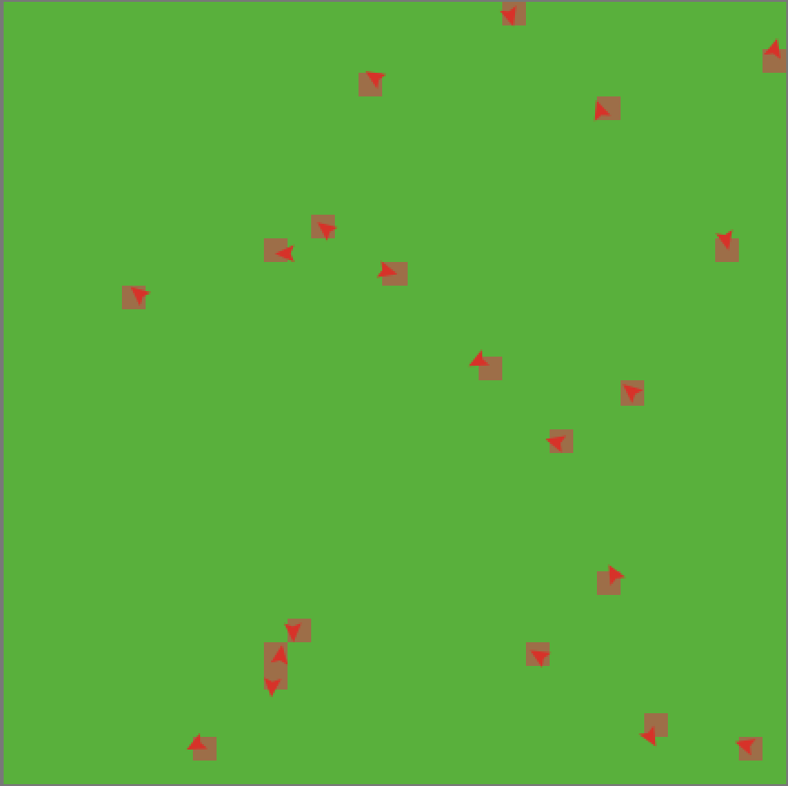
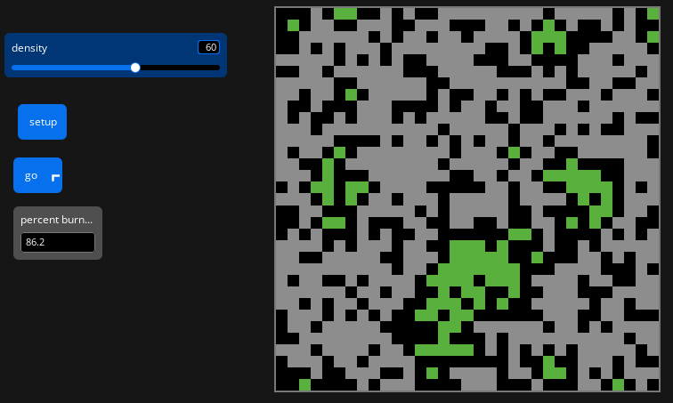

<!--
============================================================
ENVSCI 704 lab template (Week 3: agent-based modelling)
============================================================
How to use this file:

1. Copy it into your GitHub course repo and rename it, e.g.
   `lab-03-fire-spread.qmd`.
2. Fill in the YAML header above (title, your name, student ID).
3. Work through the tasks below. Delete any sections you do not need.
4. Render to PDF:
       quarto render lab-03-fire-spread.qmd --to pdf
5. Commit and push the .qmd, the rendered .pdf, AND your images/
   folder. Submit the link to the PDF on Canvas.

Tips:
- NetLogo code goes in netlogo-fenced code blocks, not Python cells.
- Write short answers in prose between code blocks and screenshots,
  not as comments inside code.
- Give every screenshot a caption so the reader knows what it shows.
- If you plot in Python, round floats when you print: f"{value:.2f}".
============================================================
-->

## How to include screenshots and images (jpg or png)

Your NetLogo results are reported as screenshots, so you will embed external image files in this document.

1. Take a screenshot of the NetLogo world or interface (on macOS press Cmd+Shift+4, on Windows use Snipping Tool).
2. Save it as a `.png` or `.jpg` file inside an `images/` folder next to this `.qmd` file, with a descriptive name such as `images/fire-density60.png`.
3. Embed it with Markdown image syntax, and add a caption and a width:

{width=70%}

Because `embed-resources: true` is set in the YAML header, the images are bundled into the rendered HTML file. Remember to commit and push the `images/` folder along with the `.qmd`, otherwise the images will be missing when the file is rendered elsewhere.

## Part A: Build the model

This model simulates a forest fire spreading from the left side of a randomly generated forest, where green trees burn and become grey after burning, with a density of 60.

Paste your NetLogo code here:

```lisp
globals [
  initial-trees
  burned-trees
]

to setup
  clear-all
  ask patches [
    if random 100 < density [ set pcolor green ]
  ]
  ask patches with [ pxcor = min-pxcor ] [
    if pcolor = green [ set pcolor red ]
  ]
  set initial-trees count patches with [ pcolor = green or pcolor = red ]
  set burned-trees 0
  reset-ticks
end

to go
  if not any? patches with [ pcolor = red ] [ stop ]
  ask patches with [ pcolor = red ] [
    ask neighbors4 with [ pcolor = green ] [
      set pcolor red
    ]
    set pcolor grey
    set burned-trees burned-trees + 1
  ]
  tick
end
```

Embed your screenshot of the world after a run:

{width=70%}

**Answer to task A1:** At a density of 60%, the model simulates a fire spreading from the left side of the forest. The screenshot above shows the state of the forest after the fire has finished spreading, with burned trees shown in grey.

**Answer to task A2:** At the end of the run, 86.2% of the trees have burned.

## Part B: Finding the critical density

Record your runs in a Markdown table:

| Density | Run 1 | Run 2 | Run 3 | Run 4 | Run 5 | Run 6 | Run 7 | Run 8 | Run 9 | Run 10 | Mean |
|---------|-------|-------|-------|-------|-------|-------|-------|-------|-------|--------|------|
| 40      | 10.7  | 10.8  | 13.3  | 17.7  | 17.6  | 21.1  | 12.3  | 13.4  | 11.9  | 19.0   | 15.8 |
| 50      | 35.0  | 48.1  | 35.0  | 29.0  | 19.8  | 46.8  | 35.0  | 43.5  | 34.6  | 24.7   | 35.9 |
| 55      | 51.5  | 51.2  | 67.2  | 62.4  | 49.2  | 80.8  | 78.5  | 78.9  | 41.2  | 84.0   | 64.9 |
| 58      | 63.8  | 77.9  | 90.4  | 91.0  | 90.3  | 89.2  | 86.1  | 83.7  | 56.2  | 83.7   | 80.2 |
| 59      | 90.8  | 85.9  | 82.0  | 79.9  | 93.3  | 92.9  | 93.1  | 87.1  | 92.6  | 87.7   | 89.5 |
| 60      | 73.5  | 90.4  | 55.4  | 90.5  | 71.9  | 90.6  | 92.7  | 86.0  | 92.3  | 87.2   | 83.05|
| 62      | 97.8  | 87.0  | 94.2  | 93.5  | 85.6  | 95.5  | 95.8  | 95.4  | 97.3  | 94.9   | 93.5 |
| 65      | 96.3  | 93.5  | 98.2  | 95.8  | 96.2  | 95.4  | 97.9  | 95.9  | 97.9  | 93.6   | 96.1 |
| 70      | 97.7  | 98.5  | 99.2  | 99.4  | 96.9  | 97.4  | 99.5  | 99.1  | 98.3  | 99.7   | 98.6 |
| 80      | 98.8  | 99.7  | 100.0 | 98.9  | 99.9  | 99.9  | 99.8  | 99.9  | 99.8  | 99.8   | 99.5 |

If you plot your results in Python, use a code cell:

```{python}
import matplotlib.pyplot as plt

density = [40, 50, 55, 58, 59, 60, 62, 65, 70, 80]
mean_burned = [15.8, 35.9, 64.9, 80.2, 89.5, 83.05, 96.1, 98.6, 98.6, 99.5]

fig, ax = plt.subplots(figsize=(6, 4))

ax.plot(density, mean_burned, marker="o")

ax.set_xlabel("Tree density (%)")
ax.set_ylabel("Mean percent burned (%)")
ax.set_title("Mean percent burned vs tree density")

plt.show()
```

**Answer to task B1:** The critical density seems to be about 58-59%, close to the theoretical value of about 59%.

**Answer to task B2:** At critical density of 59% the ten runs range from 79.9% to 93.3%, spreading about 13 percent. At a density of 40, the results were much smaller and less varied, at density 80, results showed burned areas very close to 100%. When nearing the threshold, small differences in tree placement can determine whether the fire spreads across the landscape and creates greater variability in results.The critical density seems to be about 58-59%, close to the theoretical value of about 59%.

## Part C: Summary ODD

**Answer to task C1:** The overall purpose of our model is to investigate how tree density affects the spread of fire through a forest. Specifically, we are addressing the following questions: how does the percentage of burned trees change as tree density increases, and is there a critical density at which fire spreads across most of the forest? To consider our model realistic enough for its purpose, we use the following patterns: a sharp transition from limited fire spread to widespread fire spread as tree density increases.

The model includes the following entities: patches representing areas of forest. The state variables characterising these entities are listed in Table 1. The spatial and temporal resolution and extent are set where each patch represents a small area of forest and each tick represents one time step. The model begins with a randomly distributed forest and ends when there are no red patches remaining, meaning the fire has finished spreading.

The most important processes of the model, which are repeated every time step, are fire spread and burnout. Each red burning patch changes neighbouring green patches to red, representing the fire spreading to nearby trees. The burning patch then changes to grey, representing a burned tree, and the number of burned trees is increased by one.

The most important design concepts of the model are emergence and stochasticity. The critical density threshold emerges from local fire-spreading interactions between neighbouring patches, while stochasticity occurs because tree locations are randomly generated according to the selected density. This randomness means that repeated runs at the same density can produce different percentages of burned trees.

The model is initialized with a randomly distributed forest based on the density slider. Green patches represent trees, while empty patches remain uncoloured. Trees on the leftmost edge of the world are ignited by changing them from green to red, providing the initial fire front. The density slider controls the percentage of patches initially occupied by trees, with values from 0 to 100 and a default value of 60.

Table 1. Entities and state variables

| Entity | Variable | Description | Possible values | Units |
|--------|----------|-------------|-----------------|-------|
| Patch | pcolor | Represents the state of each forest patch | Green, red, grey, or unoccupied | Colour/state |
| Global | density | Controls the initial proportion of patches containing trees | 0–100 | % |
| Global | initial-trees | Counts the number of trees initially present | 0 or more | Trees |
| Global | burned-trees | Counts the number of trees that have burned | 0 or more | Trees |


## Checklist before you push

- [ ] Every task has code or a screenshot **and** a short answer
- [ ] Every screenshot has a caption, and every plot has axis labels and a title
- [ ] The `images/` folder is committed andk pushed together with the `.qmd`
- [ ] Your name and student ID are in the YAML header
- [ ] The file renders cleanly (no missing images or red error boxes in the HTML output)
- [ ] Filename is `lab-03-topic.qmd`, not `Untitled.qmd`

